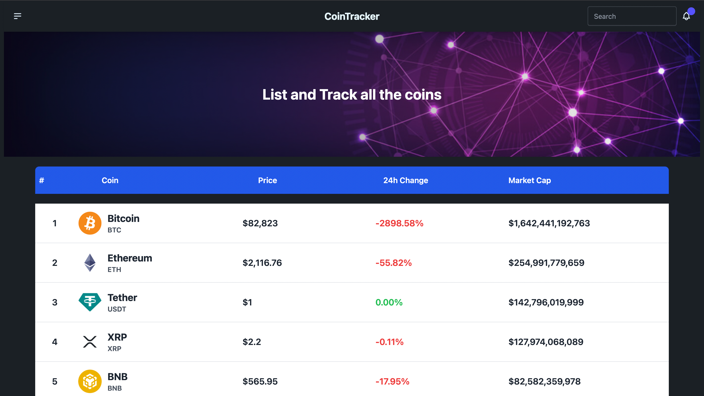

### Crypto Tracker

**Crypto Tracker** is a web application built to help users monitor and track cryptocurrency prices in real-time. It provides a clean and intuitive interface to view key metrics such as price, 24-hour change, and market cap for various cryptocurrencies. The app is powered by **React**, **TanStack Query (React Query)**, and integrates with the **CoinGecko API** to fetch live cryptocurrency data.

#### Features:

- **Real-Time Data:** Fetch and display up-to-date cryptocurrency prices and market data.
- **Pagination:** Navigate through multiple pages of cryptocurrency listings.
- **Responsive Design:** Optimized for both desktop and mobile devices.
- **Interactive UI:** Hover effects, loading states, and error handling for a smooth user experience.
- **Search Functionality:** Easily search for specific cryptocurrencies (coming soon).

#### Tech Stack:

- **Frontend:** React, Tailwind CSS
- **State Management:** React Query (TanStack Query)
- **API:** CoinGecko API

#### Why Crypto Tracker?

- **User-Friendly:** Simple and intuitive interface for both beginners and advanced users.
- **Lightweight:** Fast and efficient performance with minimal dependencies.
- **Open Source:** Fully open-source, allowing developers to contribute and customize.

#### How to Use:

1. Clone the repository.
2. Install dependencies using `npm install` or `yarn install`.
3. Run the development server with `npm start` or `yarn start`.
4. Explore the app and track your favorite cryptocurrencies!

#### Contributions:

Contributions are welcome! Feel free to open issues or submit pull requests to improve the project.

---

### Screenshots:

